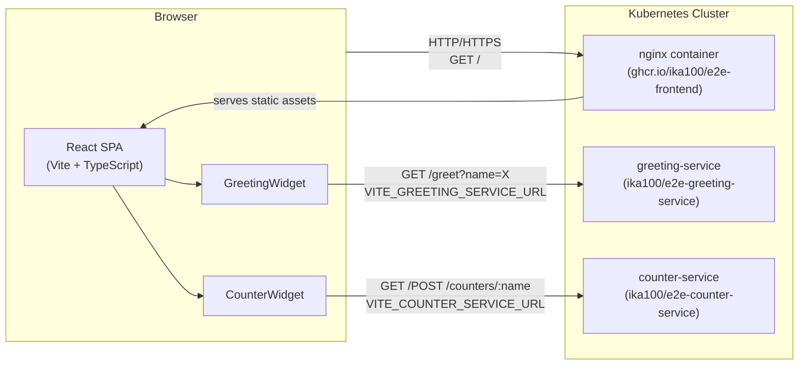

# Frontend Architecture

## Context & Goals

The `frontend` service is the browser-facing SPA for `e2e-platform`. It must:

- Provide a greeting widget (calls `greeting-service`) and a counter widget (calls
  `counter-service`).
- Be deployable as a Docker container (static files served by nginx) alongside the
  back-end microservices in Kubernetes.
- Load in ≤ 3 s on a standard connection; remain usable when a back-end service is
  temporarily unavailable.
- Pass security scans (CodeQL, Trivy, Gitleaks) with zero CRITICAL/HIGH findings.

## High-Level Component Diagram



## Components & Responsibilities

| Component | Responsibility |
|-----------|---------------|
| **React SPA** | Root application shell: routing, global error boundary, layout |
| **GreetingWidget** | Form + display for `GET /greet?name=X` calls |
| **CounterWidget** | Form + display for `GET/POST /counters/:name` calls |
| **apiClient** | Shared fetch wrapper: timeout (10 s), error normalisation, JSON parsing |
| **nginx** | Serves `/dist` static files; sets security headers (CSP, X-Frame-Options, etc.) |
| **Docker image** | Multi-stage: node builder → nginx:alpine; non-root user |

## Directory Layout (source)

```
src/
├── components/
│   ├── GreetingWidget/
│   │   ├── GreetingWidget.tsx
│   │   └── GreetingWidget.test.tsx
│   ├── CounterWidget/
│   │   ├── CounterWidget.tsx
│   │   └── CounterWidget.test.tsx
│   └── ErrorBoundary/
│       └── ErrorBoundary.tsx
├── api/
│   ├── greetingClient.ts   # GET /greet
│   └── counterClient.ts    # GET/POST /counters/:name
├── App.tsx                 # Shell, routing, layout
├── main.tsx                # Entry point
└── vite-env.d.ts           # VITE_ type declarations
```

## Key Data Flows

### 1. Greeting happy path

```
User types name → clicks "Get Greeting"
  → GreetingWidget calls greetingClient.fetchGreeting(name)
    → fetch(`${VITE_GREETING_SERVICE_URL}/greet?name=${encodeURIComponent(name)}`)
      → 200 { greeting: "Hello, Alice!" }
    → Widget sets state.greeting = "Hello, Alice!"
  → Rendered: <p>Hello, Alice!</p>
```

### 2. Counter increment

```
User types counter name → clicks "Increment"
  → CounterWidget validates name matches /^[a-zA-Z0-9_-]{1,100}$/
    → if invalid: shows inline error, no HTTP call
  → calls counterClient.incrementCounter(name)
    → fetch(POST `${VITE_COUNTER_SERVICE_URL}/counters/${name}`)
      → 200 { name: "visits", value: 5 }
    → Widget sets state.value = 5
  → Rendered: <p>visits: 5</p>
```

### 3. Error path (any widget)

```
fetch throws (network error / timeout) or response.ok === false
  → apiClient normalises to { type: "network" | "service", message: string }
  → Widget sets state.error = message
  → Rendered: <p role="alert">{state.error}</p>
  → No crash; error boundary NOT triggered
```

## Environment Configuration

| Variable | Build-time | Description |
|----------|-----------|-------------|
| `VITE_GREETING_SERVICE_URL` | Yes | Base URL for greeting-service |
| `VITE_COUNTER_SERVICE_URL` | Yes | Base URL for counter-service |

Injected via Vite's `import.meta.env`. Documented in `.env.example`.

## Cross-Cutting Concerns

### Error Handling

- **Widget-level:** Each widget catches its own API errors and renders inline messages.
- **App-level:** A React `ErrorBoundary` wraps the whole SPA to catch unexpected render
  errors and display a recovery screen.
- **No silent failures:** Every catch block either updates UI state or re-throws.

### Observability

- Browser `console.error` for all unexpected errors with stack traces.
- Network errors logged with request URL (no sensitive data in logs).
- Future: structured browser telemetry (out of scope for v0.1).

### Security Headers (nginx)

```nginx
add_header Content-Security-Policy "default-src 'self'; script-src 'self'; style-src 'self' 'unsafe-inline'; img-src 'self' data:; connect-src 'self' $GREETING_URL $COUNTER_URL; object-src 'none'; frame-ancestors 'none';";
add_header X-Frame-Options "DENY";
add_header X-Content-Type-Options "nosniff";
add_header Referrer-Policy "strict-origin-when-cross-origin";
```

### Containerisation

Multi-stage Dockerfile:
1. **Builder stage** (`node:22-alpine`): `npm ci` → `npm run build` → outputs `/dist`
2. **Runtime stage** (`nginx:alpine`): copies `/dist`, custom `nginx.conf`, runs as UID 1001

### Non-Functional Strategy

| Concern | Strategy |
|---------|---------|
| Performance | Vite code-splitting; image < 50 MB; gzip in nginx |
| Security | CSP; non-root container; CodeQL + Trivy + Gitleaks in CI |
| Availability | Widgets degrade independently; nginx serves static files reliably |
| Scalability | Stateless SPA; horizontal scaling via Kubernetes Deployment replicas |

## Links

- Specs: [`openspec/specs/`](../openspec/specs/)
- Tech-stack RFC: [`docs/rfcs/RFC-0001-tech-stack.md`](rfcs/RFC-0001-tech-stack.md)
- CI/CD: [`docs/ci-cd.md`](ci-cd.md)
- ADRs: [`docs/adr/`](adr/)
